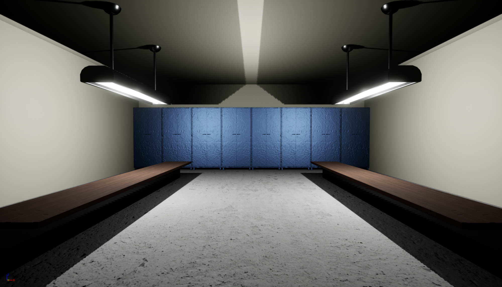
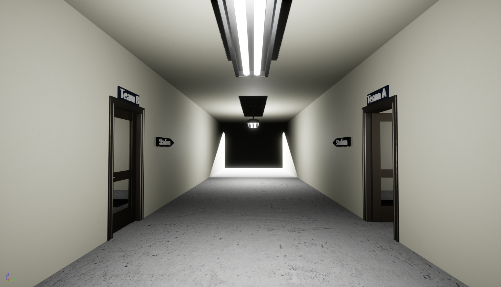
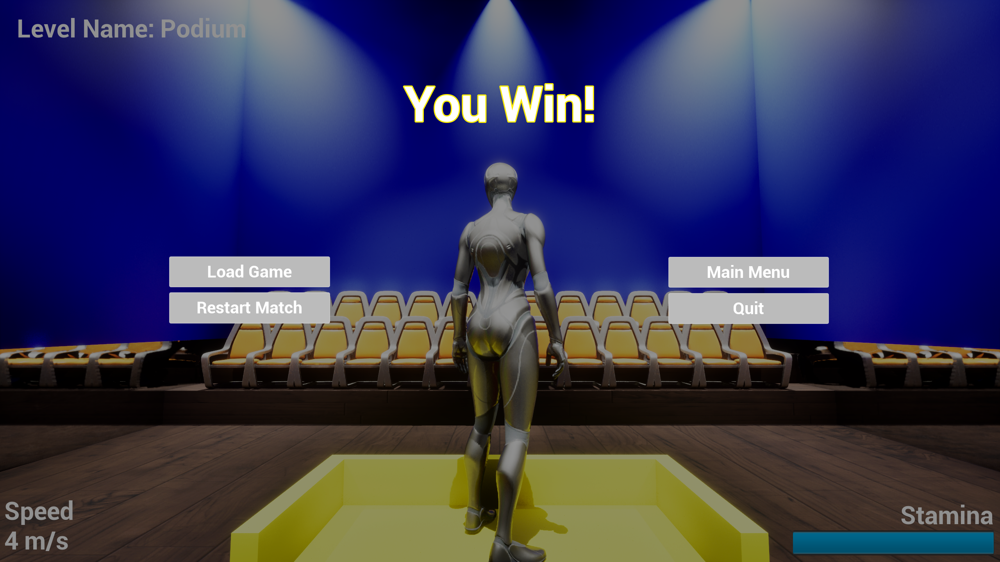
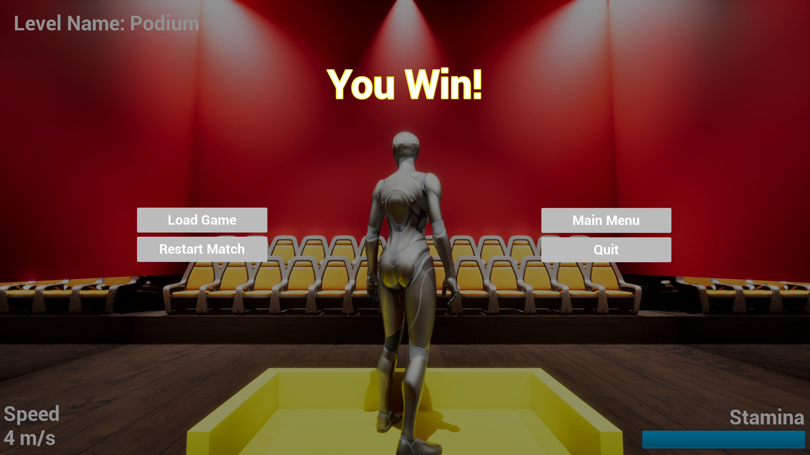

# Human League

## Team Members

[Mohammed Aminoor Rahman](https://github.com/Mrahman141)  
[Cleo Buenaventura](https://github.com/cleobnvntra)

## What is Human League

Human League is an immersive football game with three main maps: Dugout, Arena/Stadium, and Podium. Players can score goals in the Stadium, experience a celebratory strobe light effect, and celebrate victories on the Podium. The game focuses on delivering an interactive football experience, showcasing essential game development concepts like map design, actor/object implementation, lighting effects, user interface design, and AI for controlled characters. Developed for a game development course assignment, it aims to demonstrate fundamental techniques and concepts of Unreal Engine.

## Technologies Used

The project leverages Unreal Engine, a powerful game development engine, to bring the vision to life. Key technologies and concepts include:

- Unreal Engine: The foundation for game development, providing tools for designing maps, implementing actors and objects, creating animations, and managing user interfaces.
- Blueprints: Utilized for defining game logic, creating actors, and implementing various functionalities without the need for extensive coding.
- Animation: Mixamo is employed for collecting and downloading animations and character skins, enhancing the realism and movements of characters in the game.
- User Interface: Designed using Unreal Engine's UI features, including menus for main, pause, and endgame scenarios, providing a seamless and intuitive user experience.
- Artificial Intelligence: Implemented through behavior trees and sensing mechanisms, allowing AI-controlled characters (Defender and Goalkeeper) to exhibit dynamic and responsive behaviors during gameplay.

## Screenshots of the Game

### Start Menu

### Locker Room

### Hallway

### Arena

### Blue Scored

### Blue Win

### Red Scored

### Red Win

